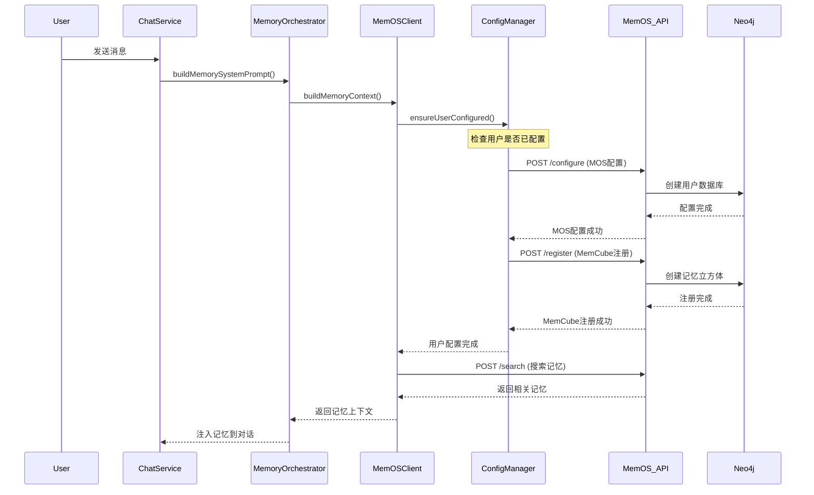
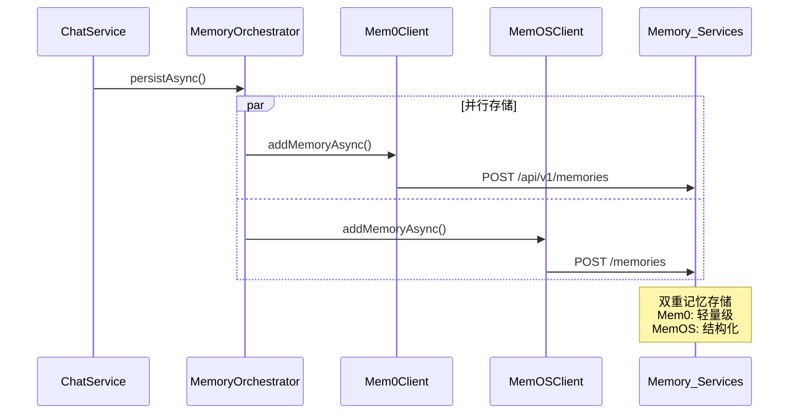

# 🧠 开启 MemOS 完整指南

## 📋 概述

本指南将帮你开启 xiaozhi-esp32-server-java 中的 MemOS 集成功能。MemOS 提供结构化的记忆存储和智能检索能力。

---

## ⚠️ **为什么之前禁用 MemOS？**

### **复杂性对比**

| 功能 | Mem0 | MemOS |
|------|------|-------|
| **配置复杂度** | 🟢 简单 | 🔴 复杂 |
| **初始化步骤** | 1 步 | 4-5 步 |
| **API 调用** | 直接调用 | 需要预配置 |
| **数据库依赖** | 无 | Neo4j + 向量库 |
| **内存开销** | 小 | 大 |

### **MemOS 需要的组件**
1. **用户管理系统** - 每个用户需要单独配置
2. **MemCube 注册** - 每个用户的记忆容器
3. **LLM 配置** - 用于记忆提取和推理
4. **向量模型** - 用于语义搜索
5. **Neo4j 数据库** - 用于图结构存储

---

## 🚀 **开启 MemOS 的步骤**

### **步骤 1: 更新配置文件**

编辑 `src/main/resources/application.properties`：

```properties
# 启用 MemOS
memory.memos-enabled=true

# 增加超时时间（MemOS 初始化较慢）
memory.memos-timeout-ms=5000

# 确保环境变量配置（推荐通过代理）
# 在部署主机或 Docker 环境中设置：
# OPENAI_API_BASE=https://aihubmix.com/v1
# OPENAI_API_KEY=sk-xxxxxxxx（请替换为有效密钥）
```

### **步骤 2: 验证远程服务**

确保远程 MemOS 服务正常运行：

```bash
# 检查 MemOS API
curl http://107.173.38.186:8000/docs

# 检查 Neo4j 数据库
curl http://107.173.38.186:7474

# 检查环境变量（代理）
ssh -i ~/.ssh/xiaozhi_deploy root@107.173.38.186 'docker logs memos-api --tail 10'
```

### **步骤 3: 重启应用**

```bash
# 停止当前应用
./gradlew bootRun --stop

# 重新启动
./gradlew bootRun
```

### **步骤 4: 测试功能**

启动后查看日志：

```bash
# 查看 MemOS 初始化日志
tail -f logs/xiaozhi.log | grep -i "memos\|memcube"

# 进行对话测试
# 第一次对话时会自动初始化用户配置
```

---

## 🔧 **工作流程详解**

### **首次用户对话时的初始化序列**



### **对话完成后的记忆存储**



---

## 🎯 **预期效果**

### **开启后的功能增强**

1. **智能记忆检索**
   - 基于语义搜索的记忆匹配
   - 图结构化的关联记忆
   - 上下文相关的记忆排序

2. **双重记忆存储**
   - Mem0: 快速轻量级存储
   - MemOS: 结构化深度存储

3. **个性化对话**
   - 每个用户的独立记忆空间
   - 长期记忆的积累和利用
   - 对话上下文的智能增强

### **性能影响**

| 指标 | 未开启 MemOS | 开启 MemOS |
|------|-------------|-----------|
| **首次对话延迟** | ~100ms | ~2-5s (初始化) |
| **后续对话延迟** | ~100ms | ~300-500ms |
| **内存使用** | +10MB | +50MB |
| **网络请求** | 1个 | 2-3个 |

---

## 📊 **监控和调试**

### **关键日志**

```bash
# 成功的日志样例
INFO  - MemOS user configuration completed for: device_12345
DEBUG - MemOS memory stored successfully for user: device_12345
DEBUG - MemOS search returned 3 relevant memories for user: device_12345

# 错误日志样例
WARN  - Failed to configure MemOS for user device_12345: Connection timeout
ERROR - MemOS search error for user device_12345: Invalid cube_id
```

### **性能监控**

```bash
# 监控配置缓存状态
grep "MemOS.*configuration.*completed" logs/xiaozhi.log | wc -l

# 监控搜索成功率
grep "MemOS.*search.*returned" logs/xiaozhi.log | wc -l

# 监控错误率
grep "MemOS.*error\|MemOS.*failed" logs/xiaozhi.log | wc -l
```

---

## 🛠️ **故障排除**

### **常见问题**

#### 1. **初始化超时**
```
WARN - Failed to configure MemOS for user xxx: timeout
```
**解决方案**:
- 增加超时时间: `memory.memos-timeout-ms=10000`
- 检查 MemOS 服务状态
- 检查 Neo4j 连接

#### 2. **Neo4j 连接失败**
```
ERROR - Neo4j connection refused
```
**解决方案**:
```bash
# 检查 Neo4j 服务
ssh -i ~/.ssh/xiaozhi_deploy root@107.173.38.186 'docker ps | grep neo4j'

# 重启 Neo4j
ssh -i ~/.ssh/xiaozhi_deploy root@107.173.38.186 'cd /opt/xiaozhi-deployment/memos && docker-compose restart neo4j'
```

#### 3. **配置缓存问题**
如果用户配置异常，清除缓存：
```java
// 在 MemOSConfigManager 中添加清除方法
public void clearUserConfig(String userId) {
    configuredUsers.remove(userId);
}
```

### **回退方案**

如果 MemOS 出现问题，可以临时禁用：

```properties
# 快速禁用 MemOS，保留 Mem0
memory.memos-enabled=false
memory.mem0-enabled=true
```

---

## 💡 **优化建议**

### **生产环境优化**

1. **配置缓存优化**
   - 使用 Redis 缓存用户配置状态
   - 设置配置过期时间

2. **连接池管理**
   - 配置 OkHttp 连接池
   - 设置合理的超时时间

3. **错误恢复**
   - 实现配置重试机制
   - 添加健康检查端点

### **未来扩展**

1. **批量操作**
   - 批量用户配置
   - 批量记忆存储

2. **记忆管理**
   - 记忆过期清理
   - 记忆质量评分

3. **可观测性**
   - 添加 Metrics 指标
   - 集成分布式追踪

---

## 📞 **技术支持**

如遇问题，请检查：

1. **服务状态**: [SERVICE_ADDRESSES.md](./SERVICE_ADDRESSES.md)
2. **集成状态**: [MEMORY_INTEGRATION_STATUS.md](./MEMORY_INTEGRATION_STATUS.md)
3. **应用日志**: `logs/xiaozhi.log`
4. **远程服务日志**: `docker logs memos-api`

---

**开启 MemOS 后，你的 AI 助手将具备真正的长期记忆能力！** 🎉
#### 4. Product API 字段与行为
- /product/users/register 的 `interests` 字段为字符串或 null，不能为空数组。
- /product/configure 期望 `config` 为可解析的模型对象，当前版本可能无法直接使用 JSON body，需要通过 query 传入字符串（并保证后端正常解析）。
- 若注册默认 cube 时报 Neo4j auto_create 断言错误，请检查服务端默认 cube 配置，允许自动创建或预置 cube。
