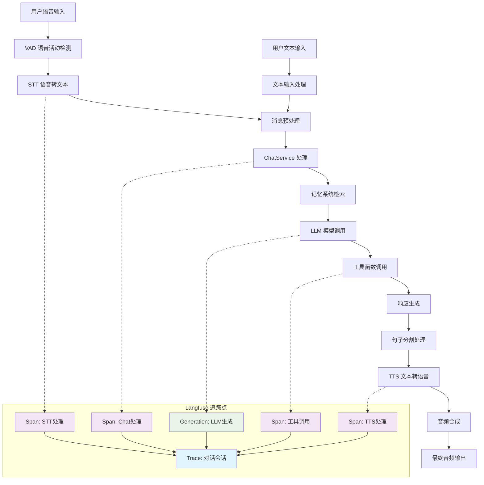
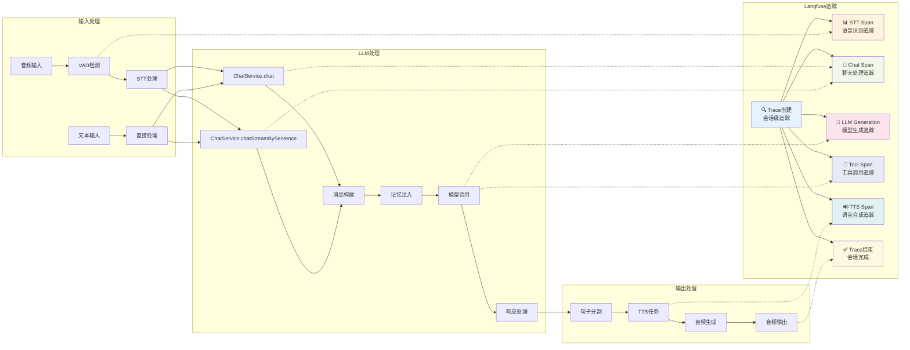
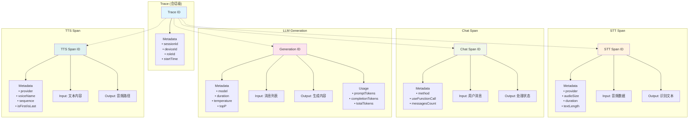
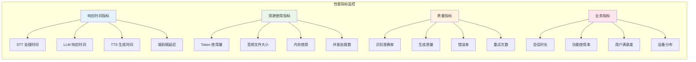

# Langfuse 完整对话链路追踪图

## 总体架构流程



## 详细技术流程图



## 追踪数据结构



## 性能监控指标



## 追踪配置说明

### 基础配置
```properties
# Langfuse 主配置
langfuse.enabled=true
langfuse.host=http://198.12.104.212:3000
langfuse.secret-key=sk-lf-5a89772f-10f4-4173-956d-1378d638eaf9
langfuse.public-key=pk-lf-e4194da0-96ee-4bf5-a556-fc3ca29d6ec4

# 性能配置
langfuse.timeout-ms=5000
langfuse.batch-size=10
langfuse.flush-interval-ms=1000
```

### 环境变量支持
- `LANGFUSE_ENABLED` - 启用/禁用追踪
- `LANGFUSE_HOST` - Langfuse 服务地址  
- `LANGFUSE_SECRET_KEY` - 私钥
- `LANGFUSE_PUBLIC_KEY` - 公钥

## 集成组件说明

### 核心组件
1. **LangfuseClient** - HTTP API 客户端，负责与 Langfuse 服务通信
2. **LangfuseService** - 高级服务接口，提供追踪功能
3. **TraceContext** - 追踪上下文管理，维护会话状态
4. **LangfuseProperties** - 配置属性管理

### 集成点
1. **ChatService** - LLM 调用和响应追踪
2. **DialogueService** - STT、TTS 和完整对话流程追踪
3. **工具调用** - Function calling 的追踪和监控

### 数据流向
```
用户输入 → STT追踪 → Chat追踪 → LLM生成追踪 → TTS追踪 → 输出完成
    ↓         ↓         ↓           ↓            ↓         ↓
  Langfuse Trace ← Span ← Span ← Generation ← Span ← 结束追踪
```

## 使用示例

### 查看追踪数据
1. 访问 Langfuse Web 界面：http://198.12.104.212:3000
2. 使用提供的公钥和私钥登录
3. 在 Traces 页面查看完整的对话链路
4. 在 Generations 页面分析 LLM 性能
5. 在 Dashboard 页面查看总体指标

### 故障排查
- 检查日志中的 Langfuse 相关信息
- 验证网络连接到 Langfuse 服务
- 确认配置文件中的密钥正确性
- 查看 Langfuse 服务状态

---

**🎯 此图表展示了完整的 xiaozhi-esp32-server-java 项目中 Langfuse 追踪集成的全貌，包含所有关键追踪点和数据流向。**
